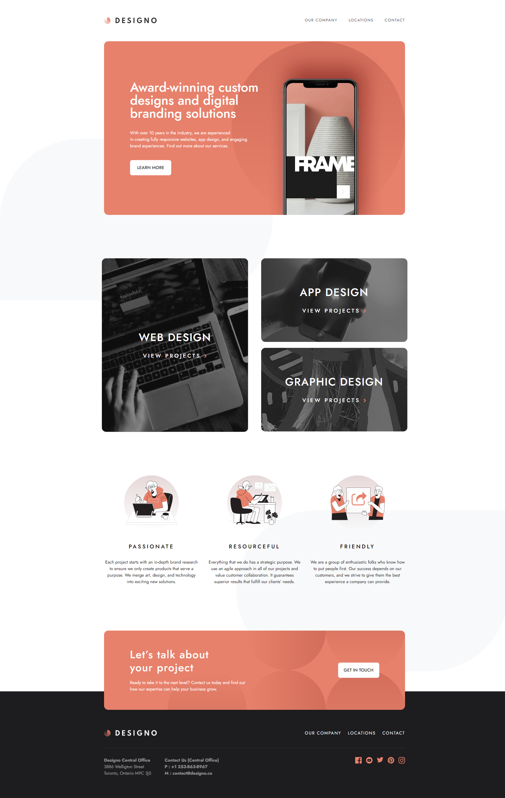
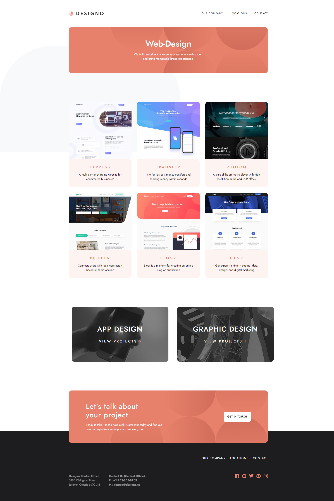
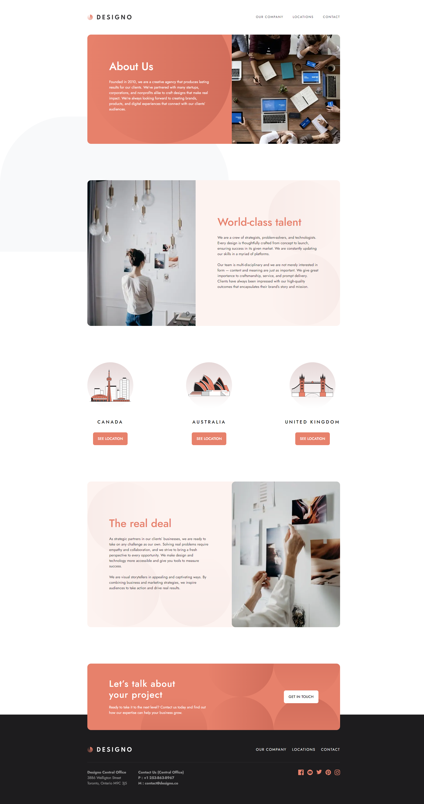
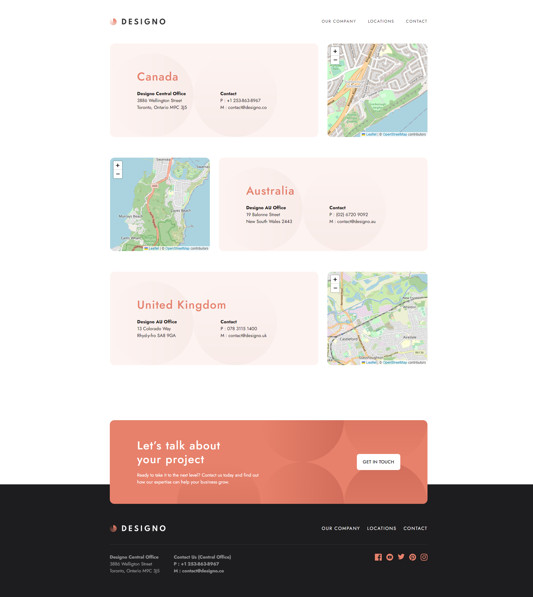
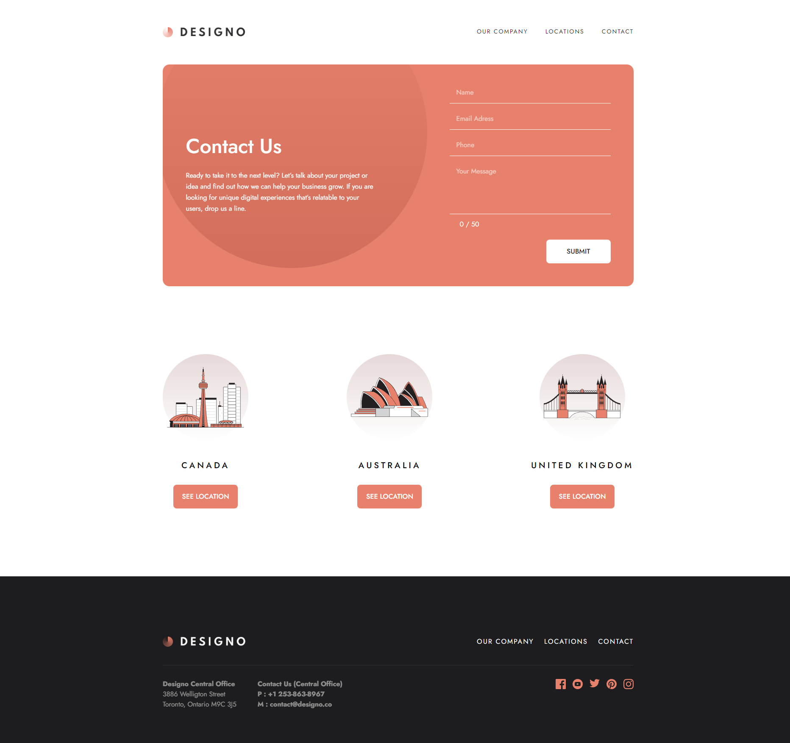

<h1 align="center">Designo multi-page website 🖥💻</h1>

<h4 align="center">
    This project is a challenge that I took from <a href="https://www.frontendmentor.io/challenges/photosnap-multipage-website-nMDSrNmNW">frontendmentor.io </a> 
    which consists of building a multiple responsive pages website. 
    I used great libraries in this project, such as: 
    <a href="https://react-hot-toast.com/">React hot toast🍞</a>,
    <a href="https://react-hook-form.com/">React hook form</a>, 
    <a href="https://zod.dev/">Zod</a> and
    <a href="https://react-leaflet.js.org/">React Leaflet</a>.  
    I used them mainly in my form and on my Location page as well.
</h4>
 

<h4 align="center">
    <a align="center" href="https://www.frontendmentor.io/challenges/designo-multipage-website-G48K6rfUT/hub">Front-end mentor challenge.</a> //
     <a align="center" href="https://designo-multi-page-website-hazel.vercel.app/">Designo Website</a>
</h4>

 

<h6 align="center"> This project was created with:</h6>
 
 

    
    
    
    
 

  

<!-- Desktop -->
<h2 align="center">Desktop Version 🖥️</h2>

<!--Made By Gustavo J. Souza -->
